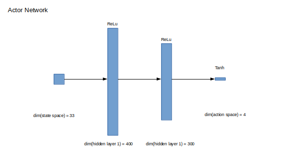
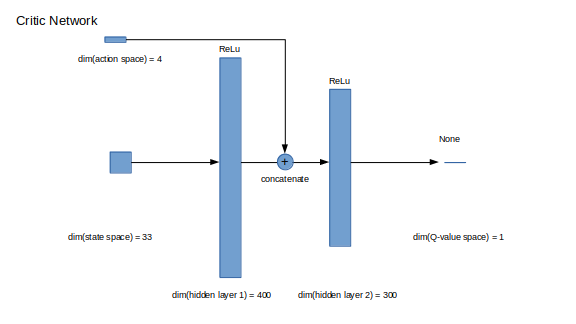
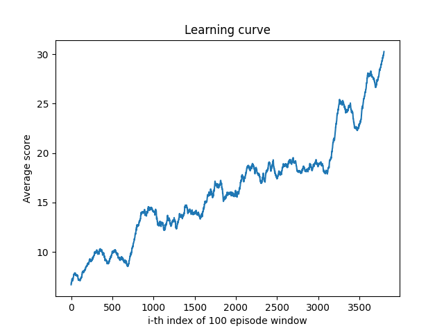

# Udacity Deep Reinforcement Learning Nano Degree
## Continuous Control Project Report

### Learning Algorithm

<!-- The report clearly describes the learning algorithm, along with the chosen hyperparameters. It also describes the model architectures for any neural networks. -->
To solve the reacher environment we adapted Deep Deterministic Policy Gradient<sup>1</sup> from the Udacity deep-reinforcement-learning repository<sup>2</sup> on GitHub. The core of the learning algorithm updates according to the following:
```python
# Get (s,a,r,s') tuples from the replay buffer.
states, actions, rewards, next_states, dones = experiences

# Update critic

# Get predicted next-state actions
actions_next = self.actor_target(next_states)

# Compute predicted target for predicted action based on the policy and s'.
Q_targets_next = self.critic_target(next_states, actions_next)

# Compute Q targets for current states (y_i)
Q_targets = rewards + (gamma * Q_targets_next * (1 - dones))

# Compute critic loss
Q_expected = self.critic_local(states, actions)

# TD_error = np.abs(Q_expected - Q_targets) so this is the average of TD_error^2
critic_loss = F.mse_loss(Q_expected, Q_targets)

# Minimize the loss
self.critic_optimizer.zero_grad() # Clear gradient
critic_loss.backward()            # Backpropagation
# Clip gradient to stabilize learning and minimize catastrophic forgetting
torch.nn.utils.clip_grad_norm_(self.critic_local.parameters(), 1)
self.critic_optimizer.step()      # Update parameters

# Update actor
actions_pred = self.actor_local(states)

# The minus sign is all-important. Without it we'd be finding the worst action to
# take. We have to do this instead of argmax because of continuous action space.
actor_loss = -self.critic_local(states, actions_pred).mean()

# Minimize the loss
self.actor_optimizer.zero_grad() # Clear gradient
actor_loss.backward()            # Backpropagation
# Clip the gradients of the actor_local network.
torch.nn.utils.clip_grad_norm_(self.actor_local.parameters(), 1)
self.actor_optimizer.step()      # Update parameters

# Now we update the target networks
self.soft_update(self.critic_local, self.critic_target, TAU)
self.soft_update(self.actor_local, self.actor_target, TAU)
```
So DDPG attempts to minimize the TD error in a similar way as DDQN<sup>6</sup>, but with the extra step of minimizing the weights of an actor network with respect to the state-action function Q( _s_, _a_ ).

To further stabilize training in consensus with the community<sup>3</sup> we added an `UPDATE_EVERY` configuration variable that ensured the algorithm wasn't making too many updates with respect to the influx of new ( _s_, _a_, _r_ ,_s'_ ) tuples according to the following rule:
```python
def step(self, state, action, reward, next_state, done):
    """Save experience in replay memory, and use random sample from buffer
    to learn."""
    self.memory.add(state, action, reward, next_state, done)

    # Learn if enough samples are available in memory AND
    # if n_steps % update_every == 0
    if len(self.memory) > BATCH_SIZE and self.n_steps % self.update_every == 0:
        experiences = self.memory.sample()
        self.learn(experiences, GAMMA)

    self.noise_modulation *= self.noise_decay
    self.n_steps += 1
```

#### Hyperparameters
The hyperparameters we used when successfully training our agent to achieve an average of 30.0 points over 100 episodes are outlined in `config.yaml`, the contents of which are reproduced for clarity below.

```yaml
# Parameters for the Unity Environment
Environment:
  # location of executable
  Filepath: ./Reacher_Linux_NoVis/Reacher.x86_64
  Success: 30.0          # score success cutoff
  # Location of ml-agents python directory.
  Unity_pythonpath: /home/thomas/downloads/ml-agents-0.4.0b/python
  Random_seed: 19        # random seed passed to all RNGs involved in code.

# Parameters for the DQN Agent
Agent:
  Buffer_size: 100000    # replay buffer size
  Batch_size: 128         # minibatch size
  Gamma: 0.99             # discount factor
  Tau: 0.001              # for soft update of target parameters
  Lr_actor: 0.0001        # learning rate for actor
  Lr_critic: 0.001        # learning rate for critic
  Weight_decay: 0.0       # L2 weight decay for regularization
  Brain_index: 0          # index of agent in environment
  Noise_decay: 1.0       # How much to decay noise modulation during each step.
  Update_every: 20       # How many agent.step()s to take before doing a learning step.

# Hyperparameters used during optimization
Training:
  Number_episodes: 10000  # Number of episodes
  Max_timesteps: 3000    # Maximum number of timesteps per episode
  Score_window: 100       # Length of averaging window for agent rewards

# Hyperparameters used to define the network architecture
Model:
  fc1_size_actor:   400    # Dimensionality of first fully connected actor layer
  fc2_size_actor:   300    # Dimensionality of second fully connected actor layer
  fcs1_size_critic: 400    # Dimensionality of first fully connected critic layer
  fc2_size_critic:  300    # Dimensionality of second fully connected critic layer
  weight_init_lim:   0.003 # Absolute value of initial weights of output layers

# Hyperparameters which define the noise process
Noise:
  Mu:    0.0            # Mean value of the noise process.
  Theta: 0.15           # weight given to (mu - x) in computation of dx
  Sigma: 0.2            # weight given to uniform random number in [0,1)

```

#### Actor Network
The architecture of the actor network which maps states onto actions is defined by the following graphic:




#### Critic Network
The architecture of the critic network which maps state and action vectors onto a scalar value is defined by the following graphic:



### Plot of Rewards

<!-- A plot of rewards per episode is included to illustrate that the agent is able to receive an average reward (over 100 episodes) of at least +30. The submission reports the number of episodes needed to solve the environment. -->
After many trials we were finally able to get our agent to learn to solve the reacher environment. To accelerate our final push for an average score of +30 over 100 episodes, we used the weights of an earlier network that reached a respectable score before the training diverged to give our agent a boost towards successfully solving the environment. The agent took 3900 episodes to learn to solve the environment.



### Ideas for Future Work

<!-- The submission has concrete future ideas for improving the agent's performance. -->
Given the similarity between DDPG and DQN, many of the enhancements to DQN that went into the Rainbow paper<sup>4</sup> are perhaps viable updates. Of particular interest is Prioritized Experience Replay<sup>5</sup>, as the number of episodes required to solve this particular task seemed excessive for the difficulty of the problem. Training more frequently on ( _s_, _a_, _r_ ,_s'_ ) tuples with a high TD error might ameliorate the poor sample efficiency we saw from DDPG in solving this environment.

### References
1. Lillicrap, Timothy P., et al. ‘Continuous Control with Deep Reinforcement Learning’. ArXiv:1509.02971 [Cs, Stat], July 2019. arXiv.org, http://arxiv.org/abs/1509.02971.
2. Udacity, deep-reinforcement-learning, (2019), GitHub repository, https://github.com/udacity/deep-reinforcement-learning
3. Nin L, Continuous Control Project - Agent Not Learning - Need Help, https://knowledge.udacity.com/questions/22843
4. Hessel, Matteo, et al. ‘Rainbow: Combining Improvements in Deep Reinforcement Learning’. ArXiv:1710.02298 [Cs], Oct. 2017. arXiv.org, http://arxiv.org/abs/1710.02298.
5. Schaul, Tom, et al. ‘Prioritized Experience Replay’. ArXiv:1511.05952 [Cs], Feb. 2016. arXiv.org, http://arxiv.org/abs/1511.05952.
6. van Hasselt, Hado, et al. ‘Deep Reinforcement Learning with Double Q-Learning’. ArXiv:1509.06461 [Cs], Dec. 2015. arXiv.org, http://arxiv.org/abs/1509.06461.
